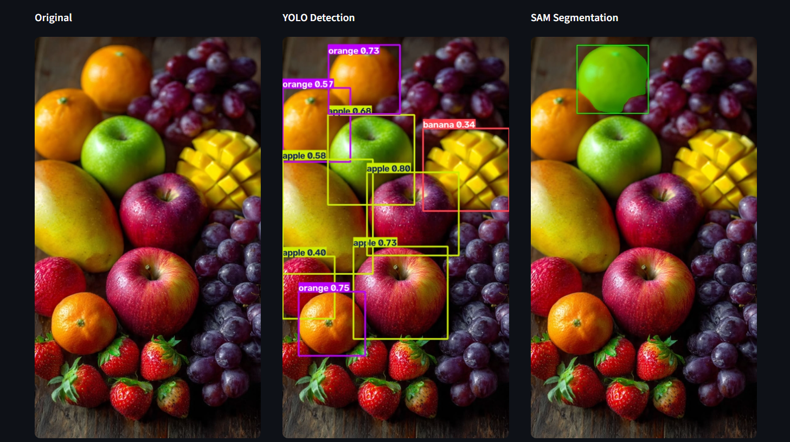

# YOLO + SAM Object Detection & Promptable Segmentation

A simple Computer Vision project that combines:

- **YOLO** for object detection.
- **SAM (Segment Anything Model)** for precise segmentation.
- **Streamlit** GUI.
- Interactive **Point** and **Box** prompts.

## Project structure

```text
yolo_sam_project/
├── task.ipynb
├── main.py
├── app.py
├── requirements.txt
└── README.md
```

## 1. Install

```bash
python -m venv .venv
```

Windows:

```bash
.venv\Scripts\activate
```

Then:

```bash
pip install -r requirements.txt
```

If you have an NVIDIA GPU, install the appropriate CUDA-enabled PyTorch build from the official PyTorch installation selector before installing/running the project.

## 2. Test the models

Open `task.ipynb`.

The notebook:
1. Installs the dependencies.
2. Downloads/loads YOLO and SAM checkpoints.
3. Runs YOLO detection on a sample image.
4. Runs SAM with a point prompt.
5. Runs SAM with a box prompt.
6. Displays the results.

## 3. Run the Streamlit app

```bash
streamlit run app.py
```

## How it works

### Automatic detection
YOLO finds objects and returns bounding boxes/classes/confidence scores.

### Point prompt
Click on an object. The selected point is converted to original-image coordinates and sent to SAM as a foreground prompt.

### Box prompt
Draw a rectangle around an object. The rectangle is converted to XYXY coordinates and sent to SAM.

SAM is promptable, so the same image can be segmented using different point or box prompts.

## Custom YOLO model

If you have trained a custom detector, place the `.pt` file in the project and enter its filename in the Streamlit sidebar, for example:

```text
best.pt
```

## Notes

- The first run downloads the model checkpoints if they are not already available.
- GPU is recommended for faster inference.
- The GUI currently uses one prompt at a time.


## Demo

The Streamlit application provides a side-by-side visualization of the complete
pipeline: the original image, YOLO object detection, and SAM segmentation.



### Example workflow

1. Upload an image.
2. Run **YOLO Detection** to detect objects.
3. Choose **Point** and click on an object, or choose **Box** and select an object with two corners.
4. Run **SAM Segmentation**.
5. Compare the **Original**, **YOLO Detection**, and **SAM Segmentation** results side by side.

## Streamlit compatibility

The app uses a compatibility-maintained fork of `streamlit-drawable-canvas`.
The original 0.9.3 release relies on an internal Streamlit image API that was
removed in newer Streamlit releases. The fork updates that import while
keeping the same Point/Box canvas API.

The project currently targets Streamlit 1.60.x.
